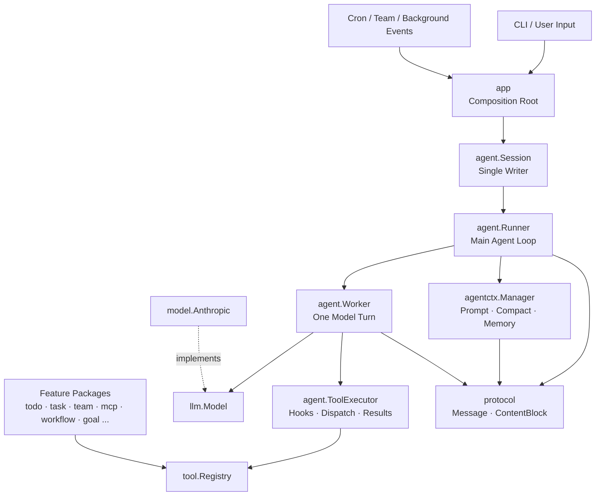
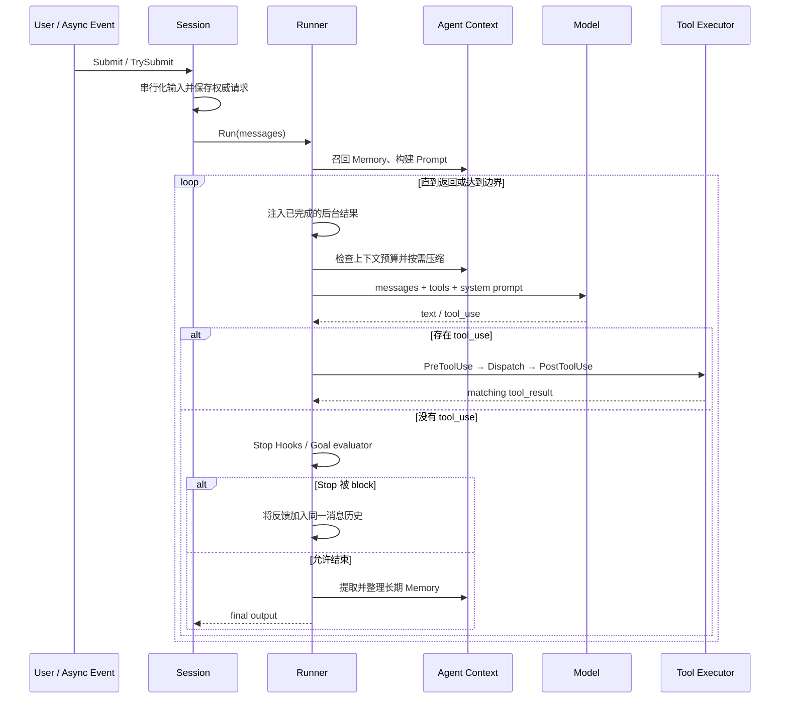

# go-agent-harness

<p align="center">
  <strong>用 Go 从零实现一个可阅读、可测试、可扩展的 Coding Agent Harness</strong>
</p>

<p align="center">
  
  
  
</p>

这是一个面向学习与架构实验的 Go 版 Coding Agent Harness。项目参考
[shareAI-lab/learn-claude-code](https://github.com/shareAI-lab/learn-claude-code)，
把 s01–s17 中逐章出现的 Agent Loop、工具、权限、上下文管理、Subagent、Team、Workflow 和 Goal Loop，
整合进同一套模块化运行时。

它不是 Claude Code 的完整复刻，也不是生产级沙箱。项目更关注一个问题：

> 模型之外，还需要哪些运行时机制，才能让 Agent 安全、持续、可恢复地完成真实任务？

```text
Agent = Model + Harness

Harness = tools + knowledge + context + permissions + runtime
```

## 项目亮点

- **一条主循环**：所有能力围绕同一个 `Session → Runner → Worker → ToolExecutor` 扩展。
- **清晰的依赖方向**：模型协议、消息协议和工具注册表与具体业务模块分离。
- **工具即模块**：工具 schema 与 handler 放在所属功能包中，组合根只负责启用能力。
- **显式安全边界**：工作区路径、PreToolUse 权限、前台审批和自动回合 fail-closed。
- **完整上下文生命周期**：Prompt、Compact、Memory 和模型恢复由 `agentctx` 统一编排。
- **多种执行形态**：一次性 Subagent、持久 Teammate、后台命令、Cron 和可信 Workflow。
- **可验证的完成条件**：Goal evaluator 作为 Stop Hook 判断任务是否真正完成。
- **面向学习的实现**：核心协议、状态迁移、并发边界和失败恢复均配有中文注释与测试。

## 快速开始

### 环境要求

- Go `1.23` 或更高版本
- Anthropic API Key，或兼容 Anthropic Messages API 的服务
- macOS / Linux；部分 Bash 与进程组行为依赖类 Unix 环境

### 1. 克隆并配置

```bash
git clone https://github.com/fredzsxie/go-agent-harness.git
cd go-agent-harness
cp .env.example .env
```

至少配置：

```dotenv
ANTHROPIC_API_KEY=sk-ant-xxx
MODEL_ID=claude-sonnet-4-6
ANTHROPIC_BASE_URL=https://api.anthropic.com
```

`.env.example` 还包含 MiniMax、GLM、Kimi、DeepSeek 等兼容服务的配置示例。

### 2. 启动

```bash
go run .
```

进入交互界面后，可以直接提交任务：

```text
分析当前项目的目录结构，并运行测试验证你的结论。
```

需要持续验证完成条件时，可以使用 Goal：

```text
/goal go test ./... exits with code 0
```

查看或清理 Goal：

```text
/goal
/goal clear
```

### 3. 验证

```bash
go test ./...
go vet ./...
go test -race ./...
```

## 架构总览

### 分层与依赖方向



核心依赖遵循：

```text
app -> agent / feature packages -> llm / tool / protocol
```

- `app` 是唯一组合根，负责选择具体实现和生命周期。
- `agent` 只编排会话、模型轮次与工具结果，不实现普通业务工具。
- `llm`、`tool`、`protocol` 是共享协议层，不依赖上层功能。
- `model` 适配 Anthropic SDK，SDK 类型不会泄漏到 Agent Loop。
- 功能模块不反向依赖 `app`；关键边界由架构测试持续检查。

### 一次请求如何运行



循环是否继续由真实的 `tool_use` block 决定，而不是依赖供应商可能不一致的 `stop_reason`。
每个 `tool_result` 都保留原始 `tool_use_id`，同一批工具结果会作为紧邻的 user 消息回填。

### 最小核心数据模型

下面是为了说明关系而简化的数据模型；锁、配置项和辅助字段已省略，完整定义见
[`protocol/message.go`](./internal/protocol/message.go)、[`llm/model.go`](./internal/llm/model.go)
和 [`tool/spec.go`](./internal/tool/spec.go)。

```go
type Session struct {
    messages      []Message // 当前会话的权威历史
    activeRequest string    // 压缩与自动唤醒后仍需保留的用户目标
    totalUsage    Usage     // 只累计主 Agent 的模型调用
}

type Message struct {
    Role    Role
    Content string         // 纯文本的便捷表示
    Blocks  []ContentBlock // 非空时是权威内容
}

type ContentBlock struct {
    Type      BlockType      // text / tool_use / tool_result
    ToolUseID string         // 关联一次调用与对应结果
    ToolName  string
    Input     map[string]any
    Text      string
    IsError   bool
}

type Request struct {
    System   string
    Messages []Message
    Tools    []tool.Spec
}

type Spec struct {
    Name       string
    Required   []string
    Properties map[string]any
}

type Handler func(context.Context, any) (string, error)
```

这些结构形成两条相互独立的关系：

```text
Session -> []Message -> []ContentBlock

llm.Request -> []tool.Spec       模型看到“能调用什么”
tool.Registry -> tool.Handler    Harness 决定“实际如何执行”
```

将 `Spec` 与 `Handler` 分开后，模型供应商只接触 JSON schema，工具实现也不需要依赖 LLM SDK。

### 工具交互协议不变量

1. `Message.Blocks` 非空时是唯一权威内容，`Content` 不会被当成第二份文本重复发送。
2. 只有真实存在的 `tool_use` block 才会推进工具循环；空结果不会制造伪造的 `tool_result` 回合。
3. 每个 `tool_result.tool_use_id` 必须匹配原始调用；同一响应中的多个工具结果会成批回填。
4. 普通工具失败会转成 `is_error=true` 交还模型修正，只有编排或上下文错误才中断宿主循环。
5. 被 `max_tokens` 截断的工具调用不会执行、不会写入 Session 历史，也不会留下缺少结果的半个回合。

### 运行时状态归属

| 状态 | 所有者 | 关键边界 |
|---|---|---|
| 会话消息与 token usage | `agent.Session` | 用户输入和自动事件共用单写入入口 |
| Agent Loop 与恢复状态 | `agent.Runner` | 不保存业务模块状态 |
| Prompt / Compact / Memory | `agentctx.Manager` | 每个 Session 独享 |
| 工具 schema 与 handler | `tool.Registry` | 支持并发读取与运行时动态注册 |
| 后台命令 | `runtime.BackgroundManager` | 结果稍后注入原 Session |
| 定时任务 | `runtime.CronScheduler` | 至少一次投递；不直接执行 Agent |
| 持久任务图 | `task.Manager` | 文件锁、所有权与依赖校验 |
| Teammate 生命周期 | `team.Runtime` | 每个 Teammate 独立消息历史 |
| Workflow checkpoint | `workflow.Store / Journal` | 独立于主会话历史 |
| 活动完成条件 | `goal.Controller` | 通过 Stop Hook 控制是否结束 |

## 核心模块

### Agent 核心

```text
Session
  └─ Runner
      ├─ Agent Context
      ├─ Recovery Policy
      └─ Worker
          └─ ToolExecutor
              ├─ Hooks
              ├─ Runtime Interceptor
              └─ Registry
```

- **Session**：串行化用户、Cron、Team 和后台完成事件，避免并发改写同一消息历史。
- **Runner**：维护主循环、上下文准备、模型恢复、Stop Hook 与最终 Memory 提取。
- **Worker**：执行一次模型调用；Subagent 和 Teammate 复用同一实现。
- **ToolExecutor**：按顺序执行一批 `tool_use`，把工具错误转换为模型可见的 `is_error` 结果。
- **Recovery**：处理 429、529、上下文超限和 `max_tokens` 截断；残缺工具调用不会产生副作用。

### 上下文与知识

| 模块 | 职责 |
|---|---|
| `prompt` | 按当前工具、时间、MCP、Teammate 和 Goal 动态构建 System Prompt |
| `compact` | 大输出落盘、旧消息裁剪、工具结果压缩和模型摘要 |
| `memory` | 长期知识的存储、召回、准入与合并 |
| `skill` | 启动时加载技能目录，按名称延迟读取 `SKILL.md` 正文 |
| `agentctx` | 把以上能力组织为一次请求的上下文生命周期 |

压缩后的历史被视为不可信参考信息；当前权威请求单独保存，历史摘要不能重新授权工具操作。

### 工具、Hook 与权限

```text
tool_use
  -> PreToolUse hooks
  -> permission.Authorizer
  -> runtime interceptor (compact / background)
  -> tool.Registry.Dispatch
  -> PostToolUse hooks
  -> tool_result
```

主 Agent 的基础工具包括：

| 分类 | 工具 |
|---|---|
| Shell 与文件 | `bash`, `read_file`, `write_file`, `edit_file`, `glob` |
| 会话计划 | `todo_write`, `compact`, `load_skill` |
| 委派与任务 | `task`, `create_task`, `update_task`, `claim_task`, `complete_task` |
| 调度与协作 | `schedule_cron`, `spawn_teammate`, `send_message`, `request_plan` |
| 扩展 | `connect_mcp`, `workflow`, 动态 `mcp__{server}__{tool}` |

安全边界：

- Bash 命令需要前台用户明确确认；硬拒绝规则始终生效。
- 自动回合不会读取终端确认，需要审批的操作直接拒绝。
- 文件工具和权限层共享同一个 Workspace Resolver。
- MCP Server 的 annotations 不构成授权，只有 Host Policy 可以放行外部工具。
- Worktree 只隔离 Git 工作目录与分支，不是操作系统沙箱。

### Subagent、Team 与 Workflow

| 机制 | 生命周期 | 上下文 | 能力边界 | 适用场景 |
|---|---|---|---|---|
| Subagent | 一次任务 | 全新 `messages[]` | 受限文件工具，无递归委派 | 有界子问题 |
| Teammate | WORK / IDLE 持久循环 | 每人独立历史 | Task、Mailbox、可选 Worktree | 持续协作与并行任务 |
| Workflow Agent | 一次无工具模型步骤 | Script 显式传入 | 无文件、Shell、MCP 工具 | 可信确定性编排 |

Team 使用文件邮箱和共享 Task Board 协作，但不共享消息历史。Plan Gate 可以在计划获批前禁止修改工作区。
Workflow 只能运行 Host 注册的可信 Script，支持并发、token budget、journal checkpoint 和恢复。

### Goal Loop

普通 Agent 在“不再调用工具”时结束；Goal Loop 增加独立完成检查：

```text
no tool_use
  -> Stop Hook
  -> pending runtime work?  -> defer
  -> independent evaluator
       ├─ block     -> 在同一历史中继续工作
       ├─ achieved  -> 完成并清理 Goal
       ├─ failed    -> 记录不可完成
       └─ limit/error -> 保留 Goal，归还用户控制
```

Evaluator 没有工具，其响应和 token usage 不进入主 Agent 会话。

## 目录结构

```text
go-agent-harness/
├── main.go                         # 极薄的进程入口
├── .env.example                    # 模型与运行时配置示例
├── learn-claude-code-go-reference.md
├── skills/                         # 项目内示例 Skill
└── internal/
    ├── app/                        # CLI、依赖装配、统一异步事件入口
    ├── agent/                      # Session、Runner、Worker、工具执行与恢复
    ├── agentctx/                   # Prompt、Compact、Memory 生命周期
    │
    ├── protocol/                   # Message / ContentBlock 与深拷贝
    ├── llm/                        # 供应商无关的 Model 接口
    ├── model/                      # Anthropic Messages API 适配
    ├── tool/                       # Spec、Handler、并发安全 Registry
    │   └── builtin/                # Bash 与文件工具
    │
    ├── hooks/                      # Agent 生命周期扩展点
    ├── permission/                 # 权限策略与人工审批边界
    ├── workspace/                  # 工作区路径解析与逃逸防护
    ├── prompt/                     # 动态 System Prompt
    │
    ├── todo/                       # Session 内临时计划
    ├── compact/                    # 分层上下文压缩
    ├── memory/                     # 长期记忆生命周期
    ├── skill/                      # Skill 目录与延迟加载
    ├── subagent/                   # 一次性子 Agent
    ├── task/                       # 持久任务 DAG
    ├── runtime/                    # Background 与 Cron
    ├── team/                       # Mailbox、Plan Gate、Teammate Runtime
    ├── worktree/                   # Task 绑定的 Git Worktree
    ├── mcp/                        # MCP discovery、Mock Server、Host Policy
    ├── workflow/                   # 可信编排、journal 与恢复
    ├── goal/                       # Goal 状态、evaluator 与 Stop gate
    └── architecture/               # 依赖方向回归测试
```

推荐阅读路径：

1. `internal/app/bootstrap.go`：理解所有组件如何装配。
2. `internal/agent/session.go`：理解输入如何被串行化。
3. `internal/agent/runner.go`：阅读主 Agent Loop。
4. `internal/agent/worker.go` 与 `tool_executor.go`：跟踪模型和工具的一次往返。
5. `internal/agentctx/manager.go`：理解上下文生命周期。
6. 按兴趣阅读具体 feature package，并结合相邻的 `*_test.go`。
7. 查看 [课程与 Go 代码对照](./learn-claude-code-go-reference.md) 了解 s01–s17 的实现映射与差异。

## 课程能力映射

| 阶段 | 课程 | 当前实现 |
|---|---|---|
| 基础循环 | s01 Agent Loop | `agent.Runner`, `model.Anthropic` |
| 工具协议 | s02 Tool Use | `tool.Registry`, `agent.ToolExecutor` |
| 安全扩展 | s03–s04 Permission / Hooks | `permission`, `hooks` |
| 单 Agent 能力 | s05–s09 Todo / Subagent / Skill / Compact / Memory | 对应 feature package + `agentctx` |
| 持久运行时 | s10–s12 Task / Background / Cron | `task`, `runtime` |
| 多 Agent | s13 Agent Teams | `team`, `worktree` |
| 外部能力 | s14 MCP | `mcp` |
| 完整集成 | s15 Integrated Harness | `app`, `agent`, `agentctx` |
| 确定性编排 | s16 Workflow Runtime | `workflow` |
| 完成验证 | s17 Goal Loop | `goal` + Stop Hook |

更细的行为边界、验收点和与 Python 参考实现的差异见
[learn-claude-code-go-reference.md](./learn-claude-code-go-reference.md)。

## 配置

| 环境变量 | 默认值 | 说明 |
|---|---|---|
| `ANTHROPIC_API_KEY` | 无 | 必填 |
| `ANTHROPIC_BASE_URL` | `https://api.anthropic.com` | Anthropic 或兼容服务地址 |
| `MODEL_ID` | `claude-sonnet-4-6` | 主 Agent 模型 |
| `FALLBACK_MODEL_ID` | 空 | 连续 overloaded 后可切换的备用模型 |
| `GOAL_EVALUATOR_MODEL_ID` | `MODEL_ID` | Goal evaluator 模型 |
| `MAX_TURNS` | `0` | 单次 Runner 的模型调用上限；`0` 表示不限制 |
| `CLAUDE_CODE_STOP_HOOK_BLOCK_CAP` | `8` | 一次请求允许的连续 Goal block 次数 |
| `LOG_MODE` | `info` | `debug`, `info`, `warn`, `error` |

## 本地运行数据

以下文件由运行时生成，并默认被 Git 忽略：

| 路径 | 内容 |
|---|---|
| `.memory/` | 长期 Memory 记录与索引 |
| `.tasks/` | 持久任务节点与文件锁 |
| `.mailboxes/` | Team 文件邮箱 |
| `.worktrees/` | Task 绑定的 Git Worktree |
| `.workflows/` | Workflow snapshot、journal、output 与 lock |
| `.transcripts/` | Compact 前保存的会话记录 |
| `.scheduled_tasks.json` | durable Cron 定义与待确认状态 |

## 设计边界

这是一个 Harness Engineering 学习项目，当前有意保留以下限制：

- MCP 仅实现课程使用的进程内 Mock Server，不包含 stdio / HTTP / SSE Transport。
- 消息协议只处理当前工具链需要的 text、tool_use 和 tool_result。
- CLI 不持久化完整 Session，进程重启后不会自动恢复对话与活动 Goal。
- Cron 只在当前进程运行时轮询，不补跑停机期间错过的时间。
- Memory 面向单 Session 串行使用，不提供跨进程事务。
- Bash deny list、Workspace Resolver 和 Git Worktree 都不是完整安全沙箱。
- Workflow 只允许 Host 注册的可信脚本，不接受模型提交任意代码。

在不受信任环境中运行模型生成的命令前，请增加容器、虚拟机或其他操作系统级隔离。

## 参考与致谢

- [shareAI-lab/learn-claude-code](https://github.com/shareAI-lab/learn-claude-code)：本项目 s01–s17 的课程基线。
- [Anthropic Claude Code](https://github.com/anthropics/claude-code)：Agentic coding tool 的产品参考。
- [OpenAI Agents SDK](https://github.com/openai/openai-agents-python)：以少量核心概念组织 Agent、工具与 Session 的文档参考。

本项目用于学习、实验和讨论 Agent Harness 的工程边界。
